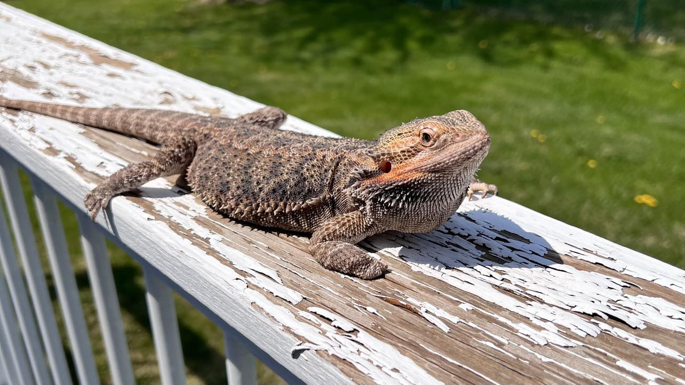

<h1 align="center">👋 Hi there, I'm Michael!</h1>

  

Passionate about technology, machine learning, a recent graduate from Metro State University. I'm on a thrilling journey to become a software engineer, eager to continue on this lifelong journey of learning.

🚀 Here are some cool things about me:

- 🔭 I’m currently working on the Full Stack JavaScript course by The Odin Project - an awesome free course for anybody interested in picking up some new skills!
- 🌱 I’m currently learning Javascript and React.
- 💬 Ask me about Java, Python, C, C++, HTML, CSS.

### 🔧 Technologies & Tools

- 💻 Java, Python, C, C++
- 🌐 HTML, CSS, JavaScript
- 🚀 React, Node.js, Express
- 📡 MySQL, MongoDB
- 🧰 Mongoose, Git, REST

### 💡 What I'm Working On

- [The Odin Project: Full Stack Javascript Course](https://www.theodinproject.com/paths/full-stack-javascript) - This course takes you through TOPs' entire JavaScript curriculum. You'll learn everything you need to know to create beautiful responsive websites from scratch using JavaScript and NodeJS.

### 💬 Let's Connect

- 😄 Interested in collaborating or just want to say hi? I'm always open to a friendly chat!

  
  

### 📈 GitHub Stats

### 🎉 Fun Fact

I'm not just a tech enthusiast! I share my home with an adorable pet bearded dragon 🦎 who's always ready for a coding pair-programming session. When I'm not diving into the world of software, you can often find me enjoying the thrill of driving my GTI on curvy roads, where I find the perfect blend of precision and exhilaration. I'm also a lifelong learner, with a passion for exploring new things, whether it's the latest in tech or diving into an entirely different field. Let's embark on this knowledge journey together! 🚗🦎📚

### Thanks for visiting! 🚀

_If you found my GitHub Profile README interesting, consider leaving a ⭐ or a friendly message! ☕_
